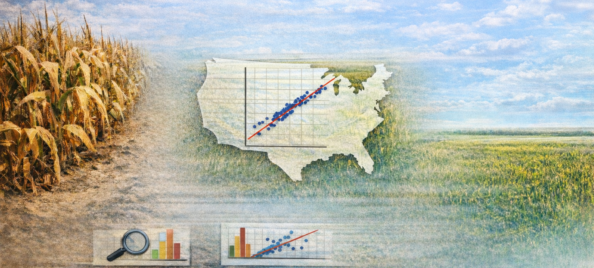

In this lab, you will use simple linear regression to study the relationship between drought severity and corn yield.

We will move from intuition to estimation, then to interpretation and diagnostics. The core idea is to connect regression output to plain-language statements about the real world.


## Learning Objectives

By the end of the lab, you will be able to:

- Fit and interpret a simple linear regression in R (`lm(y ~ x)`).
- Explain coefficients with units and comparison language.
- Distinguish estimate size from uncertainty (SE, t-stat, p-value).
- Generate predictions and interpret differences between predictions.
- Use basic diagnostics (QQ plot and residual plots) to assess fit.
- Evaluate whether a variable definition (annual mean drought) matches the research question.

## Lab Notebook

Open up a word processing document (e.g., Google Doc, Word, or plain text) to serve as your lab notebook. Use this to respond to questions, document decisions, and interpret results. You should also comment your R script thoroughly to explain your code and reasoning.

---

# Section 0: Conceptual Recap

Before we dive into the data, take a moment to think about the relationship between drought and corn yield. Consider the following questions:

- What would you expect the relationship to look like?
- Linear or curved?
- Strong or weak?

:::{.callout-attention}
Question 1 (5%): Write a few sentences describing your expectations for the relationship between:

1. drought and corn yield
2. corn yield and farm GDP 

Be sure to include the direction of the relationship, whether you expect it to be linear or non-linear, and how strong you think the relationship will be.
:::

---

# Section 1: Simulated Data and Slope Interpretation

We start with a controlled simulated dataset so coefficient interpretation is clear.

The simulation function is provided in a separate script. Source it and run it, but do not inspect its internals before estimating the model.

## Preliminaries

1. Create a folder called `lab_07`.
2. Create a new R script called `lab_07.R`.
3. Add a short header comment with your name and lab purpose.
4. Load libraries:

```{r}
#| eval: false
library(tidyverse)
library(modelsummary) #regression tables
library(broom) #processing regression output
```

## Simulate and estimate

Let's simulate some data and fit a regression model to it. The simulation function will generate a dataset with a known relationship between drought and yield, but you won't know the parameters until you inspect the function after estimation.

```{r}
#| eval: false
# Source hidden simulation function (provided by instructor)
source("https://jbayham.github.io/arec-330/modules/07_regression/includes/simulate_lab07_data.R")

sim_dat <- simulate_lab07_data()
```

Now we have a dataset `sim_dat` with two variables: `drought` (the independent variable) and `yield` (the dependent variable). We will first visualize the relationship with a scatterplot using `ggplot2`. The parameter `alpha` controls the transparency of the points, which can help visualize overlapping points.

```{r}
#| eval: false
# Scatterplot
ggplot(sim_dat, aes(x = drought, y = yield)) +
  geom_point(alpha = 0.7) +
  labs(
    title = "Simulated corn yield vs drought",
    x = "Drought index",
    y = "Yield (bu/acre)"
  )
```

Now we can fit a simple linear regression model to estimate the relationship between drought and yield. The function `lm()` fits a linear model, where `yield ~ drought` specifies that yield is the dependent variable and drought is the independent variable. The `~` symbol is used to separate the dependent variable from the independent variable(s) in the formula (like an equals sign). You can add additional variables to the model using `+`. After fitting the model, we use `summary()` to get detailed output about the coefficients, standard errors, t-statistics, and p-values.

```{r}
#| eval: false
# Fit regression
mod_sim <- lm(yield ~ drought, data = sim_dat)
summary(mod_sim)
```

## Prediction and difference interpretation

The function `predict()` generates predicted values from the fitted model. You can specify new data to get predictions for specific values of the independent variable. In this case, we will generate predicted yields for drought levels of 2 and 3, and then calculate the difference between those predictions to interpret the slope. Then we will generate predicted values for all the original data to visualize the fitted regression line on the scatterplot.

```{r}
#| eval: false
# Generate predicted values for drought = 2 and drought = 3
pred_2_3 <- predict(
  mod_sim,
  newdata = tibble(drought = c(2, 3))
)

pred_2_3
pred_2_3[2] - pred_2_3[1]

#Now generate predicted values in the original data to visualize the line
sim_dat <- sim_dat %>%
  mutate(pred_yield = predict(mod_sim, newdata = sim_dat))

#You can plot the line on top of the points
ggplot(sim_dat, aes(x = drought, y = yield)) +
  geom_point(alpha = 0.7) +
  geom_line(aes(y=pred_yield),linewidth=1,color="darkred") +
  labs(
    title = "Simulated corn yield vs drought",
    x = "Drought index",
    y = "Yield (bu/acre)"
  )

```

:::{.callout-attention}
**Question 2 (15%):** Interpret the estimated slope in one sentence with units.

Then answer:

- Based on your estimate, what do you think the true slope is likely to be?
- Is the intercept meaningful here?
- If drought increases by 0.5, what happens to predicted yield?
- Compare predicted yield at drought = 2 versus drought = 3.
- What do you think the hidden data-generating relationship might be (intercept + slope)?

After writing your answers, inspect the simulation function and compare your inferred "truth" to the actual parameters.

Interpretation prompts:

- "What does the slope mean in the real world?"
- "If drought increases by 0.5, what happens?"
:::

---

# Section 2: Regression on Real Data (Year 2017)

Now apply the same workflow to real data.

Read in the data created in prior labs:

- [final_merged_data.csv](https://jbayham.github.io/arec-330/modules/05_EDA/includes/final_merged_data.csv)

We will focus on the year 2017 for this section, but you will replicate the steps for a different year in Section 3.

```{r}
#| eval: false
combined_dat <- read_csv(
  "https://jbayham.github.io/arec-330/modules/05_EDA/includes/final_merged_data.csv"
)

dat_2017 <- combined_dat %>%
  filter(year == 2017) 

glimpse(dat_2017)
```


## Scatter plot and regression line

Similar to before, we will start with a scatter plot to visualize the relationship between drought severity (mean DSCI) and corn yield (yield in bushels per acre). The `aes()` function specifies the aesthetics of the plot, where `x` is the independent variable (mean DSCI) and `y` is the dependent variable (yield). The `geom_point()` function adds points to the plot, and `labs()` adds titles and axis labels.

```{r}
#| eval: false
ggplot(dat_2017, aes(x = mean_dsci, y = yield_bu_per_acre)) +
  geom_point(alpha = 0.7) +
  labs(
    title = "Corn yield and drought severity (2017)",
    x = "Mean DSCI (annual)",
    y = "Yield (bu/acre)"
  )
```

Then, we can estimate a simple linear regression model to quantify the relationship between mean DSCI and yield. The formula `yield_bu_per_acre ~ mean_dsci` specifies that yield is the dependent variable and mean DSCI is the independent variable. After fitting the model, we use `summary()` to get detailed output about the coefficients, standard errors, t-statistics, and p-values.

```{r}
#| eval: false
mod_2017 <- lm(yield_bu_per_acre ~ mean_dsci, data = dat_2017)
summary(mod_2017)
```

## Guided walkthrough of output

Interpretation of the regression output is critical for understanding the relationship between drought and yield. The coefficient for `mean_dsci` tells us the estimated change in yield (in bushels per acre) for a one-unit increase in mean DSCI, holding all else constant. The standard error gives us a sense of the uncertainty around that estimate. The t-statistic and p-value help us assess whether the observed relationship is statistically significant, meaning it is unlikely to have occurred by random chance alone.

The package `broom` provides tidy functions to extract pieces of the regression output. Use `tidy()` to get coefficient estimates, standard errors, t-statistics, and p-values. Use `glance()` to get overall model fit statistics.

```{r}
#| eval: false
tidy(mod_2017)
glance(mod_2017) %>%
  select(r.squared, nobs)
```


Use your output to interpret each item:

- **Coefficient** = direction + size of association.
- **Standard error** = uncertainty around the estimate.
- **t-stat / p-value** = signal relative to noise.
- **R-squared** = how much variation in yield is explained by the variables in the model.


## Regression table with `modelsummary`

`modelsummary` is a powerful package for creating regression tables. You can customize the statistics shown, add stars for significance, and export to Word. The example below shows how to create a table for the 2017 model with standard errors in parentheses and significance stars.

```{r}
#| eval: false
modelsummary(
  list("2017 model" = mod_2017),
  statistic = "({std.error})",
  stars = TRUE,
  gof_map = c("nobs", "r.squared"),
  #output = "results.docx"
)
```

Uncomment the `output` argument to export a Word document with the table into your current directory.

:::{.callout-attention}
**Question 3 (15%):**

- What is the unit of observation in `dat_2017`?
- Interpret the slope estimate with units.
- Is the slope estimate statistically significant at the 5% level? Explain what this means in plain language.
- Explain how your answer may inform your confidence in using the information for decision-making.
- What is the R-squared and how would you explain it to a non-technical audience?
:::

---

# Section 3: Diagnostics

Diagnostics help you decide whether the linear model assumptions are reasonable enough for interpretation.

## QQ plot for residual normality check

QQ plots compare the distribution of residuals to a normal distribution. If points roughly follow the red line, residuals are approximately normal. The vertical axis is the quantiles of the residuals, and the horizontal axis is the quantiles of a normal distribution. Deviations from the line suggest departures from normality and may indicate that the model assumptions are violated.

```{r}
#| eval: false
qqnorm(residuals(mod_2017))
qqline(residuals(mod_2017), col = "red", lwd = 2)
```


:::{.callout-attention}
**Question 4 (15%):** Does your QQ plot suggest that residuals are approximately normal? Research why you might care about normality of residuals in linear regression and explain what you learn.
:::

---

# Try a different year 

Replicate the above steps for a different year. Specifically:
1. Create a scatter plot with regression line for a different year.
2. Fit a regression model and interpret the slope, including statistical significance.
3. Generate a QQ plot and residuals vs fitted plot for the new model.

:::{.callout-attention}
**Question 5 (20%):** Do you see similar patterns in the scatter plot, regression output, and diagnostics between 2017 and the other year you selected? Discuss why that may be the case and what it implies about the relationship between drought and yield.
:::

---

# Taking a step back

:::{.callout-attention}
**Question 6 (20%):**
Our current drought measure is annual mean DSCI.

- Is annual mean DSCI across the whole year the most relevant drought measure for assessing the impact on corn yield? Propose an alternative measure. Describe how you would create it and why it might be more relevant for understanding the relationship between drought and yield.

- What other factors do you think are important for explaining variation in corn yield? 
:::

---

# Deliverables (10%)

Submit on Canvas:

1. **Log file (`lab_07.log`)**
   Use the sink-source-sink pattern. Your log should include code, output and comments explaining each step.

2. **Lab notebook** with answers to Questions 1-6, including the regression table, the two scatterplots with regression lines and the diagnostics plots. You should create the table and figures for 2017 and the other year you selected.


