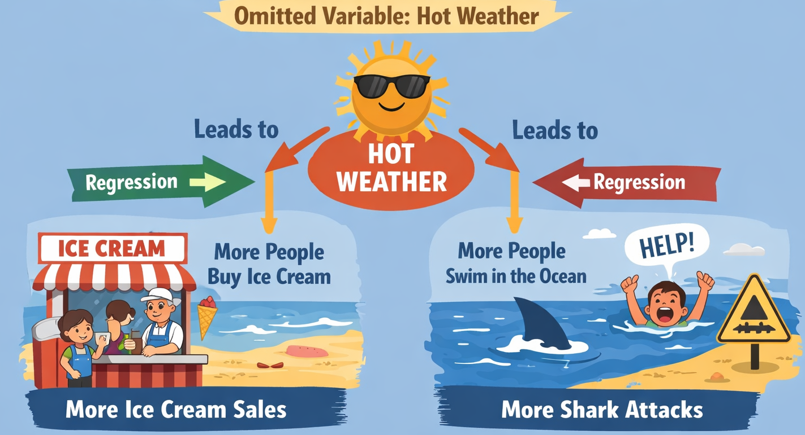
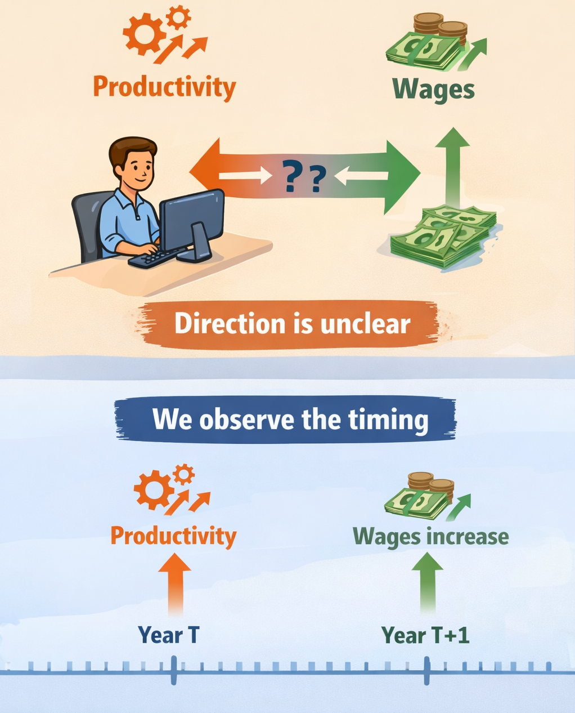

## {.iclicker} 
<div style="font-size: 0.85em;">
A monthly visitation series shows strong summer peaks, a gradual upward trend, and a sharp drop in 2020.

:::{.question}
Why might we decompose the series before forecasting?
:::

:::{.choices}
A. To eliminate randomness completely

B. To separate long-run movement from seasonal patterns

C. To guarantee a more accurate forecast

D. To avoid using a training/test split
:::
</div>

::::{.notes}
- B: Decomposing the series allows us to model the trend and seasonality separately, which can improve forecast accuracy.
:::

## {.iclicker} 
<!-- <div style="font-size: 0.65em;"> -->

:::{.question}
Why do we evaluate a forecasting model on a test set instead of the same data used to estimate it?
:::

:::{.choices}
A. Because forecasting software requires it

B. To reduce computation time

C. To simulate how the model performs on unseen future data

D. To remove seasonality
:::
<!-- </div> -->

:::{.notes}
- C: Evaluating on a test set simulates how the model will perform on future data
:::

## Explanatory Data Analysis

- Many questions in economics and business are about explaining relationships between variables.
- We can generate evidence of these relationships using regression analysis.
- There are many other methods but regression is a good starting point.

## Motivating Questions
:::{.incremental}
- Do fuel stations closer to highways charge higher prices?
- Does advertising increase sales?
- Do higher wages lead to higher productivity?
:::


## Running example: <br>Corn Yield and Drought

What is the effect of drought on corn yields?

<br>

```{mermaid}
%%{init: {"themeVariables": {"fontSize": "24px"}}}%%
flowchart LR
  G[Goals] ==> P[Problem]
  P ==> Q[Question]
  Q ==> Da[Data]
  Da ==> M[Model]
  M ==> R[Result]
  R ==> D[Decision]

  style M fill:#FFD966,stroke:#333,stroke-width:3px,color:#000
```

<br>

We seek a method that tells us how much corn yields change when drought conditions change.

## 
:::{.main-point}
Regression is a statistical method for understanding relationships between quantitative variables
:::

## Example: Gas prices and highway proximity

- Do fuel stations closer to highways charge higher prices?
- Can you tell by looking at a map of gas stations and highways?
- <https://www.gasbuddy.com/gasprices/wyoming/cheyenne>

## Explanation vs. Prediction
- Regression can be used for both explanation and prediction.
- Explanation focuses on understanding the relationship between variables (e.g., how does drought affect corn yields?).
- Prediction focuses on accurately forecasting future values (e.g., what will corn yields be next year?).
- A good explanation may provide a good prediction*

## How does regression work?

- Regression estimates the relationship between a dependent variable and one or more independent variables.
- It quantifies how much the dependent variable changes when the independent variable(s) change.
- It does this by "fitting a line" through the data points that best captures the relationship.
- What do we mean by "best" fit?

## Regression demo

- What is the equation of a line?
- The data give us our x and y values. Coordinates.
- We can visualize the data as points on a scatterplot.
- We want to find the line that best fits those points.

Go to R

:::{.notes}
- motivate the generation of the data
- experiment with the class moving the line
- show how the line changes with different slopes and intercepts (parameters)
- the solution is the line that minimizes the sum of squared errors. why squared errors? why not absolute errors?
- End on seed=20 n=54

:::

## Regression math{.scrollable}

- The regression line is defined by the equation: 
$$
y = \alpha + \beta x + \epsilon
$$

    - $\alpha$ is the intercept (the value of $y$ when $x=0$)
    - $\beta$ is the slope (the change in $y$ for a one-unit change
    in $x$)
    - $\epsilon$ is the error term (the difference between the observed and predicted values)

Rearranging gives us:
$$
y - \alpha - \beta x = \epsilon
$$

The regression line is the one that minimizes the sum of squared errors:
$$
\min_{\alpha, \beta} \sum_{i=1}^n (y_i - \alpha - \beta x_i)^2
$$

Differentiating with respect to $\alpha$ and $\beta$ and setting the derivatives to zero gives us the normal equations, which we can solve to find the estimates of $\alpha$ and $\beta$.

$$
\begin{cases}
\sum_{i=1}^n (y_i - \alpha - \beta x_i) = 0 \\
\sum_{i=1}^n x_i (y_i - \alpha - \beta x_i) = 0
\end{cases}
$$

We have 2 equations with 2 unknowns. Solving these equations yields the least squares estimates:
$$
\hat{\beta} = \frac{\sum_{i=1}^n (x_i - \bar{x})(y_i - \bar{y})}{\sum_{i=1}^n (x_i - \bar{x})^2}
$$
$$
\hat{\alpha} = \bar{y} - \hat{\beta} \bar{x}
$$

$\beta$ is also the covariance of $x$ and $y$ divided by the variance of $x$:
$$
\hat{\beta} = \frac{\text{Cov}(x, y)}{\text{Var}(x)}
$$  

# Interpretting Regression Results

## Regression Results Overview
- The regression results provides estimates of the coefficients (intercept and slope) along with their standard errors, t-values, and p-values.
- The output is generally reported in a table
- You need to understand how to read and interpret this table to draw meaningful conclusions from the regression analysis.

## Example regression output: Estimate

<br>

| Variable  | Estimate |
|-----------|:--------:|
| x         | -4.23    |
| Intercept | 4.48     |

<br>
This is just an estimate of the true relationship between x and y. We need to understand uncertainty.

## Example regression output: Standard Errors

<br>

| Variable  | Estimate | Std. Error |
|-----------|:--------:|:----------:|
| x         | -4.23    | 0.23       |
| Intercept | 4.48     | 0.27       |

<br>
Does 0.23 seem small or large relative to the estimate of -4.23? 

## 
```{r}
#| echo: false
#| warning: false
#| message: false
#| fig-width: 8
#| fig-height: 4.2

beta_hat <- -4.23
se_beta  <- 0.23

x <- seq(beta_hat - 4 * se_beta, beta_hat + 4 * se_beta, length.out = 2000)
y <- dnorm(x, mean = beta_hat, sd = se_beta)

plot(x, y, type = "l", lwd = 2,
     xlab = expression(beta), ylab = "Density",
     main = expression("Sampling uncertainty around " * hat(beta)))

# Shade ±1 standard error around estimate
x_band <- x[x >= (beta_hat - se_beta) & x <= (beta_hat + se_beta)]
y_band <- dnorm(x_band, mean = beta_hat, sd = se_beta)
polygon(c(x_band, rev(x_band)), c(y_band, rep(0, length(y_band))),
  col = "gray80", border = NA)
lines(x, y, lwd = 2)

abline(v = beta_hat, lwd = 2)
abline(v = c(beta_hat - se_beta, beta_hat + se_beta), lty = 2)

text(beta_hat, .5, expression(hat(beta) == -4.23), pos = 4)
text(beta_hat - se_beta, max(y) * 0.80, expression(hat(beta) - SE), pos = 2)
text(beta_hat + se_beta, max(y) * 0.80, expression(hat(beta) + SE), pos = 4)
```

The standard error indicates typical sampling variation around the estimate.

## Hypothesis Testing
- We need a way to determine if the observed relationship is statistically significant or if it could have occurred by random chance.
- We use a standardized test statistic (t-statistic) to test the null hypothesis that the true coefficient is zero (no relationship).
$$
t = \frac{\hat{\beta} - 0}{SE(\hat{\beta})}
$$

## 
```{r}
#| echo: false
#| warning: false
#| message: false
#| fig-width: 8
#| fig-height: 4.2


df <- 52
t_obs <- -18.39
alpha <- 0.05
t_crit <- qt(1 - alpha/2, df)

# Plot range chosen for teaching: shows critical values clearly
x <- seq(-5, 5, length.out = 2000)
y <- dt(x, df)

plot(x, y, type = "l", xlab = "t", ylab = "Density",
     main = sprintf("t distribution (df = %d): two-sided test at α = %.2f", df, alpha))

# Shade rejection regions (tails beyond ±t_crit)
x_left  <- x[x <= -t_crit]
y_left  <- dt(x_left, df)
polygon(c(x_left, rev(x_left)), c(y_left, rep(0, length(y_left))),
        col = "gray80", border = NA)

x_right <- x[x >=  t_crit]
y_right <- dt(x_right, df)
polygon(c(x_right, rev(x_right)), c(y_right, rep(0, length(y_right))),
        col = "gray80", border = NA)

# Draw critical value lines
abline(v = c(-t_crit, t_crit), lty = 2)
text(-t_crit, max(y)*0.95, sprintf("-t* = %.2f", t_crit), pos = 2)
text( t_crit, max(y)*0.95, sprintf("t* = %.2f", t_crit), pos = 4)


```

null hypothesis ($H_0$: $\beta = 0$); $~~~~~~~ t=(\beta - 0)/\sigma_\beta$

## 
```{r}
#| echo: false
#| warning: false
#| message: false
#| fig-width: 8
#| fig-height: 4.2

df <- 52
t_obs <- -18.39
alpha <- 0.05
t_crit <- qt(1 - alpha/2, df)

# Plot range chosen for teaching: shows critical values clearly
x <- seq(-5, 5, length.out = 2000)
y <- dt(x, df)

plot(x, y, type = "l", xlab = "t", ylab = "Density",
     main = sprintf("t distribution (df = %d): two-sided test at α = %.2f", df, alpha))

# Shade rejection regions (tails beyond ±t_crit)
x_left  <- x[x <= -t_crit]
y_left  <- dt(x_left, df)
polygon(c(x_left, rev(x_left)), c(y_left, rep(0, length(y_left))),
        col = "gray80", border = NA)

x_right <- x[x >=  t_crit]
y_right <- dt(x_right, df)
polygon(c(x_right, rev(x_right)), c(y_right, rep(0, length(y_right))),
        col = "gray80", border = NA)

# Draw critical value lines
abline(v = c(-t_crit, t_crit), lty = 2)
text(-t_crit, max(y)*0.95, sprintf("-t* = %.2f", t_crit), pos = 2)
text( t_crit, max(y)*0.95, sprintf("t* = %.2f", t_crit), pos = 4)

# Mark observed t.
# It's off the plotted range; show an arrow indicating it's far beyond the left tail.
if (t_obs < min(x)) {
  arrows(x0 = -4.2, y0 = dt(-4.2, df)+.03, x1 = -4.95, y1 = dt(-4.95, df) +.03, length = 0.1)
  text(-4.2, dt(-4.2, df)+.03, sprintf("observed t = %.2f (far left)", t_obs), pos = 4)
} else {
  abline(v = t_obs, lwd = 2)
  text(t_obs, max(y)*0.8, sprintf("observed t = %.2f", t_obs), pos = 4)
}

# Optional: label acceptance region
#text(0, max(y)*0.35, "Fail to reject H₀ region", cex = 0.9)
#text(-3.2, dt(-3.2, df)*1.2, "Reject H₀", cex = 0.9)
#text( 3.2, dt( 3.2, df)*1.2, "Reject H₀", cex = 0.9)
```


## Example regression output: t-statistics

<br>

| Variable  | Estimate | Std. Error | t-stat |
|-----------|:--------:|:----------:|:------:|
| x         | -4.23    | 0.23       | -18.39 |
| Intercept | 4.48     | 0.27       | 16.59  |

## Example regression output: p-values

<br>

| Variable  | Estimate | Std. Error | t-stat | p-value |
|-----------|:--------:|:----------:|:------:|:-------:|
| x         | -4.23    | 0.23       | -18.39 | <0.001  |
| Intercept | 4.48     | 0.27       | 16.59  | <0.001  |


## Interpreting Coefficient Estimates

- The coefficient estimates tell us the **expected change** in the dependent variable for a one-unit change in the independent variable
- In our example, the slope of -4.23 means that for every one-unit increase in x, y is expected to decrease by 4.23 units.
- If x was miles from the highway, this would mean that for every additional mile from the highway, gas prices are expected to decrease by 4.23 cents.

## Estimating Uncertainty: Standard Errors

- The estimates are just that: estimates. They are subject to sampling variability.
- What if we repeated the study with a different sample of gas stations? or a different period in time? Would we get the same estimates?
- The standard error gives us a measure of how much the estimate would vary across different samples.

## Hypothesis Testing{.scrollable}

- We make assumptions about the error term $\epsilon$ (e.g., it is normally distributed with mean 0 and constant variance) that allow us to perform hypothesis tests on the coefficients.
- The null hypothesis is typically that the coefficient is equal to zero (no effect).
- The t-statistic is the estimate divided by its standard error, and the p-value tells us the probability of observing such an extreme t-statistic if the null hypothesis were true.
- In our example, the t-statistic of -18.39 for the slope indicates that the coefficient is highly statistically significant (p < 0.001), suggesting a strong relationship between distance from the highway and gas prices.

:::{.notes}
Imagine testing whether a coin is fair.
If you flip 10 times and get 6 heads:
Not that surprising.
If you flip 100 times and get 95 heads:
Very surprising if coin is fair.
The p-value quantifies “how surprising.”
:::


## {.iclicker} 
<div style="font-size: 0.75em;">
Dependent variable: Gas Price ($/gallon)

| Variable                    | Estimate | Std. Error | t-stat | p-value |
| --------------------- | -------- | ---------- | ------ | --------- |
| Distance to Highway (miles) | -0.04    | 0.02       | -2.00  | 0.048   |
| Constant                    | 3.50     | 0.10       | 35.00  | <0.001  |


:::{.question}
What does the coefficient on distance to highway mean?
:::

For every additional mile from the highway...

:::{.choices}
A. gas prices are expected to decrease by 4 cents.

B. gas prices are expected to decrease by 0.02 cents.

C. gas prices are expected to increase by 3.50 dollars.

D. gas prices are expected to decrease by 4 dollars.
:::
</div>

## {.iclicker} 
<div style="font-size: 0.65em;">
Dependent variable: Daily Mountain Bike Trail Visits

| Variable          | Estimate | Std. Error | t-stat | p-value |
| ----------------- | -------- | ---------- | ------ | ------- |
| Temperature (°F)  | 12.5     | 8.3        | 1.51   | 0.130  |
| Constant          | -300.0   | 150.0      | -2.00  | 0.048   |

:::{.question}
Which of the following is true about the relationship between temperature and daily mountain bike trail visits?
:::

:::{.choices}
A. Each 1°F increase in temperature causes 12.5 more trail visits per day.

B. A 1°F increase in temperature is associated with 12.5 more visits per day, and this relationship is statistically significant at the 5% level.

C. A 1°F increase in temperature is associated with 12.5 more visits per day, but the estimate is not statistically significant at the 5% level.

D. Temperature has no relationship with trail visits because the p-value is greater than 0.05.
:::
</div>


## Summary

- Regression is a powerful tool for quantifying relationships between variables.
- Coefficient estimates tell us the expected change in the dependent variable for a one-unit change in the independent variable.
- Standard errors and hypothesis tests help us understand the uncertainty around our estimates.
- Interpretation of regression results requires careful consideration of the context and the assumptions underlying the model. (Pirates vs. global warming example)

## Lab Preview

- We will use regression to analyze the relationship between drought conditions and corn yields.
- We will learn how to fit a regression model, interpret the output, and evaluate the model's assumptions and performance.

# Part 2

<!-- clicker questions -->

## {.iclicker} 
<div style="font-size: 0.65em;">

Dependent variable: Daily Mountain Bike Trail Visits

| Variable          | Estimate | Std. Error | t-stat | p-value |
| ----------------- | -------- | ---------- | ------ | ------- |
| Temperature (°F)  | 12.5     | 8.3        | 1.51   | 0.130  |
| Constant          | -300.0   | 150.0      | -2.00  | 0.048   |

:::{.question}
The coefficient on temperature means:
:::

:::{.choices}
A. A 1°F increase in temperature is associated with an increase of 12.5 daily trail visits, on average.

B. A 1°F increase in temperature changes trail visits by 8.3 per day.

C. A 1°F increase in temperature changes trail visits by 0.130 per day.

D. When temperature is 0°F, trail visits increase by 12.5 per day.
:::
</div>


## {.iclicker} 
<div style="font-size: 0.65em;">
Dependent variable: Daily Mountain Bike Trail Visits

| Variable          | Estimate | Std. Error | t-stat | p-value |
| ----------------- | -------- | ---------- | ------ | ------- |
| Temperature (°F)  | 12.5     | 8.3        | 1.51   | 0.130  |
| Constant          | -300.0   | 150.0      | -2.00  | 0.048   |

:::{.question}
Which of the following is true about the relationship between temperature and daily mountain bike trail visits?
:::

:::{.choices}
A. Each 1°F increase in temperature causes 12.5 more trail visits per day.

B. A 1°F increase in temperature is associated with 12.5 more visits per day, but the estimate is not statistically significant at the $alpha=0.05$ level.

C. A 1°F increase in temperature is associated with 12.5 more visits per day, and this relationship is statistically significant at the $alpha=0.05$ level.

D. If temperature was 0, the model would predict 0 visits.
:::
</div>


## {.iclicker} 
<div style="font-size: 0.65em;">

Dependent variable: Daily Mountain Bike Trail Visits

| Variable          | Estimate | Std. Error | t-stat | p-value |
| ----------------- | -------- | ---------- | ------ | ------- |
| Temperature (°F)  | 12.5     | 8.3        | 1.51   | 0.130  |
| Constant          | -300.0   | 150.0      | -2.00  | 0.048   |

:::{.question}
The p-value tells you:
:::

:::{.choices}
A. The probability of getting a test statistic this extreme (or more extreme) if the true coefficient were 0.

B. The probability that the null hypothesis is true.

C. The probability that the true temperature effect is exactly 12.5 visits per day.

D. The probability that temperature causes changes in trail visits.
:::
</div>

## Recap

- Regression is a useful tool for quantifying relationships between variables (explanatory analysis)
- Coefficient estimates tell us the expected change in the dependent variable for a one-unit change in the independent variable.
- Standard errors and hypothesis tests help us understand the uncertainty around our estimates.


## Regression can mislead

Regression finds patterns in the data.

But patterns **do not always** reflect causal relationships.

A regression coefficient can be misleading when:

- Important variables are missing

- The direction of cause and effect is unclear

- Differences across places or people are ignored

<!-- E conomists call these threats to identification. -->


## Problem 1: Omitted Variables

Suppose we estimate:

$$\text{Gas Price} = \alpha + \beta \times \text{Distance to Highway} + \epsilon$$

But what if we are missing an important variable that explains variation in gas prices?

- neighborhood income

- competition from nearby stations

- traffic volume

If these factors affect both distance and price, the estimate of $\beta$ can be biased.


## Omitted Variable Example

Estimate a regression of ice cream sales ($1000s) on shark attacks

| Variable        | Estimate | Std. Error | t-stat | p-value |
| --------------- | :------: | :--------: | :----: | :-----: |
| Ice Cream |   2.1    |    0.42     |  5.00  | <0.001  |

<br>
Interpret the coefficient on ice cream sales.

:::{.incremental}
- What could be missing from this regression that would explain the relationship between ice cream sales and shark attacks?
:::

:::{.notes}
Each additional $1,000 in ice cream sales causes 2 more shark attacks.

But the real story:

Hot weather or increased popularity increases both.

Temperature is the omitted variable.
:::


## Omitted Variable Bias

::::{.columns}

::: {.column width="50%"}
Omitting a variable correlated with both the independent and the dependent variable can **bias** the estimates of the regression coefficients.
:::

::: {.column width="50%"}

:::
::::

:::{.notes}
In the ice cream and shark attack example, the omitted variable (temperature) is positively correlated with both ice cream sales and shark attacks, leading to a spurious positive relationship between the two. True causal effect is zero. 
:::

## Another Example: Drought and Corn Yields
```{r}
library(tidyverse)

set.seed(330)

n_years <- 20

# Create panel structure
df <- expand_grid(
  state = c("High Soil Quality", "Low Soil Quality"),
  year = 2001:(2000 + n_years)
)

# Generate drought and yield
df <- df %>%
  group_by(state) %>%
  mutate(
    
    # Low-yield state tends to have more drought
    drought = ifelse(
      state == "High Soil Quality",
      rnorm(n(), mean = 1.5, sd = 0.35),
      rnorm(n(), mean = 2.5, sd = 0.35)
    ),
    
    # True yield differences across states
    # IMPORTANT: drought has NO effect within state
    yield = ifelse(
      state == "High Soil Quality",
      rnorm(n(), mean = 185, sd = 30),
      rnorm(n(), mean = 135, sd = 30)
    )
    
  ) %>%
  ungroup()

# Demean within state (fixed effects idea)
df_dm <- df %>%
  group_by(state) %>%
  mutate(
    drought_dm = drought - mean(drought),
    yield_dm = yield - mean(yield)
  ) %>%
  ungroup()

# Regressions
m_pool <- lm(yield ~ drought, data = df)
m_dm <- lm(yield_dm ~ drought_dm, data = df_dm)

pool_slope <- round(coef(m_pool)[2], 2)
dm_slope <- round(coef(m_dm)[2], 2)

# Plot 1: misleading pooled regression with cluster labels
# compute label positions (centroids) and nudge them so labels sit near clusters
labels <- df %>%
  group_by(state) %>%
  summarise(drought = mean(drought), yield = mean(yield)) %>%
  ungroup() %>%
  mutate(yield = if_else(state == "High Soil Quality", yield + 30, yield - 30))

ggplot(df, aes(drought, yield)) +
  geom_point(alpha=.5,size = 3) +
  geom_smooth(method = "lm", se = FALSE, color = "black", linewidth = .7) +
  labs(
    subtitle = paste("Slope =", pool_slope),
    x = "Drought severity",
    y = "Corn yield"
  ) +
  theme_minimal(base_size = 15) +
  theme(legend.position = "top")

```

## If you could measure soil quality

```{r}
ggplot(df, aes(drought, yield, color = state)) +
  geom_point(size = 3,show.legend = FALSE) +
  #geom_smooth(method = "lm", se = FALSE, color = "black", linewidth = 1.2) +
  geom_label(data = labels,
            aes(x = drought, y = yield, label = state, color = state),
            size = 6, fontface = "bold", show.legend = FALSE) +
  labs(
    #subtitle = paste("Slope =", pool_slope),
    x = "Drought severity",
    y = "Corn yield"
  ) +
  theme_minimal(base_size = 15) +
  theme(legend.position = "top")

```


## Reverse Causality
- Sometimes the direction of cause and effect is unclear.
- For example, does higher wages lead to higher productivity, or does higher productivity lead to higher wages?
- This can lead to biased estimates if we do not account for the possibility of reverse causality.

:::{.notes}
Reverse causality can be thought of as a feedback loop where the independent variable affects the dependent variable, and the dependent variable also affects the independent variable. This can make it difficult to determine the true causal relationship between the variables.

The direction of the bias depends on the nature of the relationship. For example, if higher wages lead to higher productivity, but higher productivity also leads to higher wages, the bias could be positive or negative depending on the relative strength of these effects.
:::

## Exploit timing

<div style="font-size: 0.80em;">

::::{.columns}
::: {.column width="58%"}
- If we have data over time, we can use the timing of events to help establish causality.
- For example, if wages increase *after* a productivity improvement, this supports the idea that productivity is driving wages rather than the other way around.
:::

::: {.column width="42%"}

:::
::::
</div>

## Measurement Error

- If the independent variable is measured with error, it can bias the coefficient estimates toward zero.
- Suppose our drought variable is measured with error. 

## True relationship

```{r}
library(tidyverse)

set.seed(330)

# ----------------------------
# 1. Simulate "true" data
# ----------------------------
n <- 120

df <- tibble(
  drought_true = runif(n, 0, 5),
  yield_true   = 190 - 12 * drought_true + rnorm(n, 0, 5)
)

# Add measurement error
df <- df %>%
  mutate(
    drought_obs = drought_true + rnorm(n, 0, 1.0),   # noisy x
    yield_obs   = yield_true   + rnorm(n, 0, 10.0)   # noisy y
  )

# Regression slopes for annotations
m_true        <- lm(yield_true ~ drought_true, data = df)
m_drought_err <- lm(yield_true ~ drought_obs,  data = df)
m_yield_err   <- lm(yield_obs  ~ drought_true, data = df)

b_true        <- coef(m_true)[2]
b_drought_err <- coef(m_drought_err)[2]
b_yield_err   <- coef(m_yield_err)[2]

# Consistent axis limits across figures
x_lim <- range(c(df$drought_true, df$drought_obs))
y_lim <- range(c(df$yield_true, df$yield_obs))

base_theme <- theme_minimal(base_size = 18) +
  theme(
    plot.title = element_text(face = "bold"),
    panel.grid.minor = element_blank()
  )

# ----------------------------
# Figure 1: True relationship
# ----------------------------
ggplot(df, aes(x = drought_true, y = yield_true)) +
  geom_point(size = 2.8, alpha = 0.5) +
  geom_smooth(method = "lm", se = FALSE, linewidth = 1.2, color = "black") +
  coord_cartesian(xlim = x_lim, ylim = y_lim) +
  labs(
    title = "True relationship between drought and yield",
    subtitle = paste0("Estimated slope = ", round(b_true, 2)),
    x = "True drought severity",
    y = "True corn yield"
  ) +
  base_theme

```

## Drought measured with error

```{r}
# ----------------------------
# Figure 2: Measurement error in drought
# ----------------------------
ggplot(df, aes(x = drought_obs, y = yield_true)) +
  geom_point(size = 2.8, alpha = 0.5) +
  geom_smooth(method = "lm", se = FALSE, linewidth = 1.2, color = "black") +
  coord_cartesian(xlim = x_lim, ylim = y_lim) +
  labs(
    title = "Measurement error in drought",
    subtitle = paste0("Estimated slope = ", round(b_drought_err, 2)),
    x = "Observed drought severity (measured with error)",
    y = "True corn yield"
  ) +
  base_theme

```

## Unobserved Differences

Places and people differ in ways that we may not be able to measure.

Corn yield varies across states because of:

- soil quality

- farming practices

- irrigation infrastructure


If we ignore them, regression may attribute these differences to drought.

## Drought Reduces Yield

```{r}
library(tidyverse)

set.seed(330)

n_years <- 20

# Create panel structure
df <- expand_grid(
  state = c("High-yield state", "Low-yield state"),
  year = 2001:(2000 + n_years)
)

# Generate drought and yield
df <- df %>%
  group_by(state) %>%
  mutate(
    
    # Low-yield state tends to have more drought
    drought = ifelse(
      state == "High-yield state",
      rnorm(n(), mean = 1.5, sd = 0.35),
      rnorm(n(), mean = 2.5, sd = 0.35)
    ),
    
    # True yield differences across states
    # IMPORTANT: drought has NO effect within state
    yield = ifelse(
      state == "High-yield state",
      rnorm(n(), mean = 185, sd = 30),
      rnorm(n(), mean = 135, sd = 30)
    )
    
  ) %>%
  ungroup()

# Demean within state (fixed effects idea)
df_dm <- df %>%
  group_by(state) %>%
  mutate(
    drought_dm = drought - mean(drought),
    yield_dm = yield - mean(yield)
  ) %>%
  ungroup()

# Regressions
m_pool <- lm(yield ~ drought, data = df)
m_dm <- lm(yield_dm ~ drought_dm, data = df_dm)

pool_slope <- round(coef(m_pool)[2], 2)
dm_slope <- round(coef(m_dm)[2], 2)

# Plot 1: misleading pooled regression with cluster labels
# compute label positions (centroids) and nudge them so labels sit near clusters
labels <- df %>%
  group_by(state) %>%
  summarise(drought = mean(drought), yield = mean(yield)) %>%
  ungroup() %>%
  mutate(yield = if_else(state == "High-yield state", yield + 30, yield - 30))

ggplot(df, aes(drought, yield)) +
  geom_point(alpha=.5,size = 3) +
  geom_smooth(method = "lm", se = FALSE, color = "black", linewidth = .7) +
  labs(
    subtitle = paste("Slope =", pool_slope),
    x = "Drought severity",
    y = "Corn yield"
  ) +
  theme_minimal(base_size = 15) +
  theme(legend.position = "top")

```

## What if its variation by state

```{r}
ggplot(df, aes(drought, yield, color = state)) +
  geom_point(size = 3,show.legend = FALSE) +
  #geom_smooth(method = "lm", se = FALSE, color = "black", linewidth = 1.2) +
  geom_label(data = labels,
            aes(x = drought, y = yield, label = state, color = state),
            size = 6, fontface = "bold", show.legend = FALSE) +
  labs(
    #subtitle = paste("Slope =", pool_slope),
    x = "Drought severity",
    y = "Corn yield"
  ) +
  theme_minimal(base_size = 15) +
  theme(legend.position = "top")

```

## How economists address this

Economists try to create comparisons that mimic experiments.

Instead of comparing different states, we compare the **same state in different years**.

This helps control for things that do not change over time.

## Fixed Effects Regression

Fixed effects regression compares each unit to itself over time.

**Instead of asking:** Do states with more drought have lower yields?

**We ask:** When drought becomes worse in a state, do yields fall in that same state?

This removes time-invariant differences like:

- soil quality

- elevation


## Demeaning the data

- One way to implement fixed effects regression is to demean the data within each state.
- This means we subtract the state-specific mean from each observation, effectively centering the data around zero for each state.
- The regression is then run on the demeaned data, which controls for any time-invariant differences across states.

$$
{Y}_{it} - \bar{Y}_i = \alpha_i + \beta \times ({D}_{it} - \bar{D}_i) + \epsilon_{it}
$$

## Demeaned data

```{r}
ggplot(df_dm, aes(drought_dm, yield_dm, color = state)) +
  geom_vline(xintercept = 0, linetype = "dashed", color = "gray60") +
  geom_hline(yintercept = 0, linetype = "dashed", color = "gray60") +
  geom_point(size = 3) +
  #geom_smooth(method = "lm", se = FALSE, color = "black", linewidth = 1.2) +
  labs(
    #title = "After demeaning by state, the relationship disappears",
    #subtitle = paste("Slope =", dm_slope),
    x = "Drought (demeaned within state)",
    y = "Yield (demeaned within state)"
  ) +
  theme_minimal(base_size = 15) +
  theme(legend.position = "none")
```

$$
{Y}_{it} - \bar{Y}_i = \alpha_i + \beta \times ({D}_{it} - \bar{D}_i) + \epsilon_{it}
$$


## FE Regression (demeaned data)

```{r}
ggplot(df_dm, aes(drought_dm, yield_dm, color = state)) +
  geom_vline(xintercept = 0, linetype = "dashed", color = "gray60") +
  geom_hline(yintercept = 0, linetype = "dashed", color = "gray60") +
  geom_point(size = 3) +
  geom_smooth(method = "lm", se = FALSE, color = "black", linewidth = 1.2) +
  labs(
    #title = "After demeaning by state, the relationship disappears",
    subtitle = paste("Slope =", dm_slope),
    x = "Drought (demeaned within state)",
    y = "Yield (demeaned within state)"
  ) +
  theme_minimal(base_size = 15) +
  theme(legend.position = "none")
```

$$
{Y}_{it} - \bar{Y}_i = \alpha_i + \beta \times ({D}_{it} - \bar{D}_i) + \epsilon_{it}
$$

## Discussion

How does the fixed effects regression relate to a series of state-specific regressions?

## Summary

- Regression can be a powerful tool for understanding relationships between variables, but it can also be misleading if we are not careful.
- Omitted variables, reverse causality, and unobserved differences can all lead to biased estimates.
- Economists use techniques like fixed effects regression to try to control for these issues and get closer to the true causal relationships.


