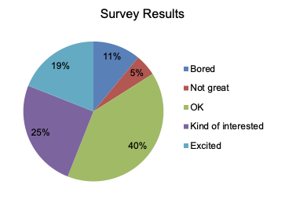
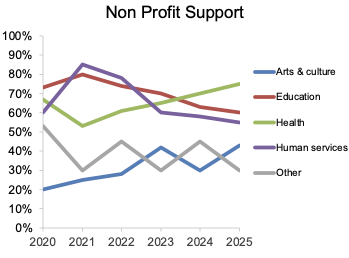
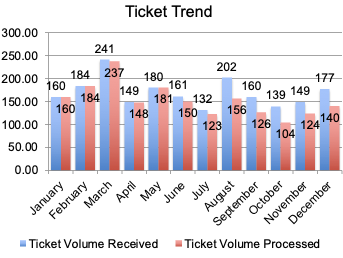
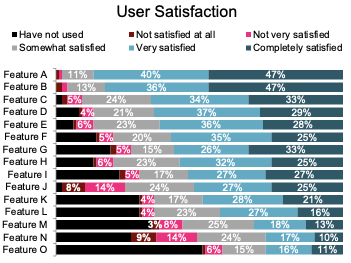
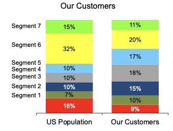
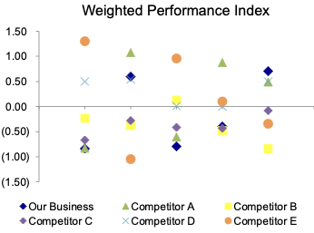
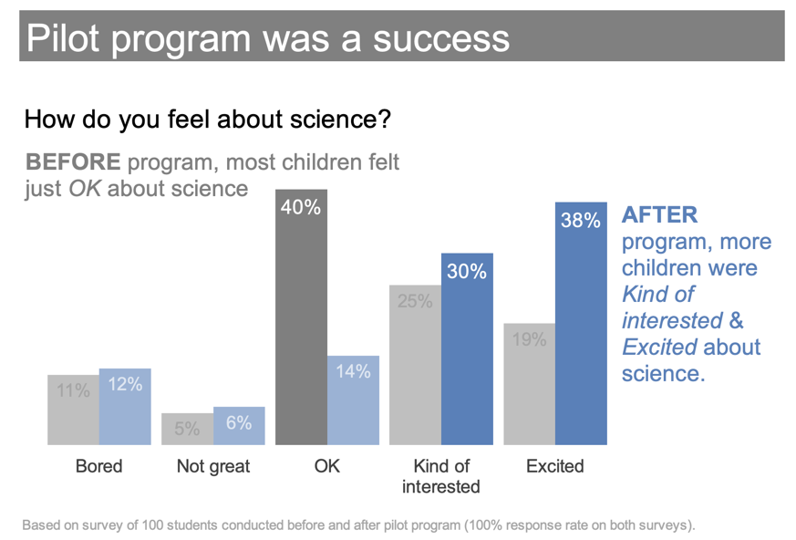

## Shifting Focus {.scrollable}

- Up to now, much of the work has been about **analysis**
- From now on, we will spend more time on **communication**
- A technically correct result is not enough if nobody can quickly understand it
- The value of analysis depends on whether it informs a decision

:::{.notes}
Time: 2 minutes.

Suggested transition:
"You now know enough to produce analysis. The next question is whether you can present it in a way that someone else can act on."
:::

## Big Picture: Course Logic

```{mermaid}
%%{init: {"themeVariables": {"fontSize": "24px"}}}%%
flowchart LR
  G[Goals] ==> P[Problem]
  P ==> Q[Question]
  Q ==> Da[Data]
  Da ==> M[Model]
  M ==> R[Result]
  R ==> V[Visual Story]
  V ==> D[Decision]

  style V fill:#FFD966,stroke:#333,stroke-width:3px,color:#000
```

:::{.notes}
Time: 2 minutes.

Reuse the course logic students already know. The new emphasis is the step between result and decision: the visual story.
:::

## Good Visuals

Good visuals are not just about making charts.

They are about helping someone understand what matters and what to do next.


:::{.notes}
Time: 1 minute.
:::

## Why Bad Graphs Are Everywhere

- Graphs/charts are easy to create
- Good graphs are much harder to design
- Most people are not naturally trained to tell stories with numbers
- Software can generate charts quickly, but not always well
- Many graphs show data without communicating a clear message

:::{.notes}
Time: 3 minutes.

This is the basic setup from the reading introduction. Emphasize that "bad graph" does not mean fake or incorrect. It often means technically possible but communicatively weak.
:::

## Showing Data vs. Telling a Story <br> Adding Value

:::: {.columns}

::: {.column width="50%"}
**Showing data**

:::{.incremental}

- report the numbers
- present the default chart
- treat every detail as equally important
- leave the audience to find the point

:::
:::

::: {.column width="50%"}
**Telling a story**

:::{.incremental}

- start from the decision or question
- choose a visual that fits the comparison
- reduce clutter
- focus attention
- make the takeaway visible
:::
:::

::::

:::{.notes}
Time: 3 minutes.

This is a useful line to repeat:
"Showing data says: here it is. Storytelling says: here is what matters."
:::

## {.iclicker}

:::{.question}
A technically correct chart still fails if the audience cannot quickly tell:
:::

:::{.choices}
A. which software created it

B. what the main takeaway is

C. whether the data are quantitative

D. how long it took to build
:::

:::{.notes}
Time: 1 minute.

B. Use this to reinforce that communication quality is part of analytical quality.
:::

<!-- ## A Working Framework

1. Understand the context
2. Choose an appropriate visual
3. Reduce clutter
4. Focus attention
5. Tell a story

We will use this as a checklist for the rest of the unit.

:::{.notes}
Time: 2 minutes.

This maps directly onto the reading and sets up the rest of today.
::: -->

# Activity: Graph Diagnosis

## Graph Diagnosis: Small Groups{.scrollable}

**Discuss**

- What is wrong with this graph?
- What do you think the intended message is?
- Why does the graph fail to communicate it?

Be ready to report one redesign move.

:::{.notes}
Time: 1 minute to set up, 6-7 minutes for group work.

If you have six groups, assign one graph per group.

:::

<!-- ## Group Assignments

- Group 1: pie chart
- Group 2: multi-line chart
- Group 3: grouped bar chart
- Group 4: stacked horizontal bars
- Group 5: stacked composition bars
- Group 6: scatterplot / index chart

You can either assign one graph per group or circulate through the next six slides during discussion.

:::{.notes}
Time: 30 seconds.

This slide exists so you can assign quickly. Then use the next slides during group work and debrief.
::: -->

## Graph 1

<div style="background: white; padding: 18px; border-radius: 16px;">
  
</div>

- What is wrong with this graph?
- What do you think the intended message is?
- Why does the graph fail to communicate it?

:::{.notes}
- What is wrong with this graph?
  - too many categories for a pie chart
  - colors do not help direct attention
  - legend creates eye travel
- What do you think the intended message is?
  - The distribution of categories, but no clear takeaway about what matters
- Why does the graph fail to communicate it?
  - Pie charts make it hard to compare slices, especially when there are many categories
  - The legend creates eye travel and the colors do not help direct attention

:::

## Graph 2

<div style="background: white; padding: 18px; border-radius: 16px;">
  
</div>

- What is wrong with this graph?
- What do you think the intended message is?
- Why does the graph fail to communicate it?

:::{.notes}

- What is wrong with this graph?
  - too many lines shown with equal visual weight
  - legend creates eye travel
  - no single series is emphasized
  - no clear takeaway about trend or comparison
- What do you think the intended message is?
  - There is a trend in the data, but it is not clear which one or why it matters

- Why does the graph fail to communicate it?
  - Line charts are good for showing trends, but the many lines make it hard to see any particular trend or comparison
  - The legend creates eye travel and the colors do not help direct attention


:::

## Graph 3

<div style="background: white; padding: 18px; border-radius: 16px;">
  
</div>

- What is wrong with this graph?
- What do you think the intended message is?
- Why does the graph fail to communicate it?

:::{.notes}
- What is wrong with this graph?
  - too many labels
  - angled month names
  - grouped bars make the gap harder to track
  - no explicit statement of why the comparison matters

- What do you think the intended message is?
  - There is a gap in the backlog, but it is not clear how big it is or why it matters

- Why does the graph fail to communicate it?
  - The grouped bars make it harder to see the gap than necessary
  - The labels are crowded and the angled text makes them harder to read
  - The title does not state the takeaway or decision implication
:::

## Graph 4

<div style="background: white; padding: 18px; border-radius: 16px;">
  
</div>

- What is wrong with this graph?
- What do you think the intended message is?
- Why does the graph fail to communicate it?

:::{.notes}
- What is wrong with this graph?
  - too many categories for a stacked bar chart
  - colors do not help direct attention
  - legend creates eye travel
  - no clear takeaway about what matters
- What do you think the intended message is?
  - Satisfaction is highest for features A and B
- Why does the graph fail to communicate it?
  - Stacked bar charts make it hard to compare categories, especially when there are many
  - The legend creates eye travel and the colors do not help direct attention
:::

## Graph 5

<div style="background: white; padding: 18px; border-radius: 16px;">
  
</div>

- What is wrong with this graph?
- What do you think the intended message is?
- Why does the graph fail to communicate it?

:::{.notes}
- What is wrong with this graph?
  - too many categories for a stacked horizontal bar chart
  - colors do not help direct attention
  - no clear takeaway about what matters
- What do you think the intended message is?
  - Customers don't look like the US populaltion
- Why does the graph fail to communicate it?
  - Stacked horizontal bar charts make it hard to compare categories, especially when there are many
  - The colors do not help direct attention and the legend creates eye travel
:::

## Graph 6

<div style="background: white; padding: 18px; border-radius: 16px;">
  
</div>

- What is wrong with this graph?
- What do you think the intended message is?
- Why does the graph fail to communicate it?

:::{.notes}
- What is wrong with this graph?
  - it is hard to compare the performance across businesses and over time
  - the index chart makes it hard to see the actual values and the gap between them

- What do you think the intended message is?
  - our business is improving by the end
- Why does the graph fail to communicate it?
  - clutter makes it hard to compare 
:::

## Debrief: What Problems Recur?

:::{.incremental}
- clutter competes with the message
- poor chart choice makes comparison difficult
- color is used without purpose
- legends create unnecessary eye travel
- context is missing: compared to what, and why does it matter?
- there is no clear takeaway
:::

:::{.notes}
Time: 4 minutes.

This is the synthesis slide for the diagnosis activity. Write student language on the board and then map it back to these recurring problems.
:::

## 

:::{.main-point}
The story is not automatically in the data.<br><br>
The analyst has to surface it.
:::

:::{.notes}
Time: 1 minute.
:::

# Activity: <br>Before vs. After

## Before vs. After

- First we will walk through one example together
- Then you will do a second example in pairs before seeing the redesign
- Focus on what changed and why it improves communication

:::{.notes}
Time: 1 minute.
:::

```{r}
#| echo: false
#| include: false

library(ggplot2)

story_theme <- theme_minimal(base_size = 15) +
  theme(
    plot.background = element_rect(fill = "white", color = NA),
    panel.background = element_rect(fill = "white", color = NA),
    panel.grid.minor = element_blank(),
    legend.title = element_blank(),
    axis.title.x = element_text(margin = margin(t = 10)),
    axis.title.y = element_text(margin = margin(r = 10))
  )
```

## Full-Class Walkthrough: Before

What do you notice first?

What decision, if any, would this chart support?

```{r}
#| echo: false
#| warning: false
#| message: false
#| fig-width: 8
#| fig-height: 4.8

channels <- c("Phone", "Email", "Chat", "In-person", "Social")
wait <- c(12.4, 8.1, 5.2, 4.8, 7.0)
df <- data.frame(
  channel = factor(channels, levels = channels),
  wait = wait
)

ggplot(df, aes(x = channel, y = wait, fill = channel)) +
  geom_col(width = 0.72, color = "gray55") +
  geom_text(aes(label = paste0(wait, " min")), vjust = -0.35, size = 4) +
  scale_fill_manual(
    values = c(
      "Phone" = "#4F81BD",
      "Email" = "#C0504D",
      "Chat" = "#9BBB59",
      "In-person" = "#8064A2",
      "Social" = "#4BACC6"
    )
  ) +
  scale_y_continuous(
    limits = c(0, 14),
    breaks = seq(0, 14, 2),
    expand = expansion(mult = c(0, 0.06))
  ) +
  labs(
    title = "Average Wait Time by Channel",
    x = NULL,
    y = "Average wait time (minutes)"
  ) +
  story_theme +
  theme(
    axis.text.x = element_text(angle = 45, hjust = 1),
    panel.grid.major.x = element_blank(),
    legend.position = "right"
  )
```

:::{.notes}
Time: 3-4 minutes.

Let students struggle productively for a moment. They will probably notice that phone is highest, but many will not know whether 12.4 minutes is actually bad because the chart lacks context.
:::

## Full-Class Walkthrough: After

Decision implication:

Add staffing or redesign queue management for **phone support**.

```{r}
#| echo: false
#| warning: false
#| message: false
#| fig-width: 8
#| fig-height: 4.8

channels <- c("Phone", "Email", "Social", "Chat", "In-person")
wait <- c(12.4, 8.1, 7.0, 5.2, 4.8)
df <- data.frame(
  channel = factor(channels, levels = rev(channels)),
  wait = wait,
  highlight = ifelse(channels == "Phone", "Highlight", "Other")
)

ggplot(df, aes(x = channel, y = wait, fill = highlight)) +
  geom_hline(yintercept = seq(0, 14, 2), color = "gray92") +  
  geom_col(width = 0.72, color = NA, show.legend = FALSE) +
  geom_hline(yintercept = 10, color = "#C0504D", linewidth = 1, linetype = "dashed") +
  geom_text(aes(label = paste0(wait, " min")), hjust = -0.15, size = 4) +
  annotate(
    "text",
    x = 3.85,
    y = 10.2,
    label = "10-minute target",
    color = "#C0504D",
    hjust = 0,
    size = 4
  ) +
  scale_fill_manual(values = c("Highlight" = "#C8C372", "Other" = "gray75")) +
  scale_y_continuous(
    limits = c(0, 14.6),
    breaks = seq(0, 14, 2),
    expand = expansion(mult = c(0, 0))
  ) +
  coord_flip() +
  labs(
    title = "Phone support is the only channel above the 10-minute target",
    x = NULL,
    y = "Average wait time (minutes)"
  ) +
  story_theme +
  theme(
    panel.grid.major.y = element_blank(),
    plot.margin = margin(10, 30, 10, 10)
  )
```

:::{.notes}
Time: 3-4 minutes.

Ask:

- What changed?
- What is easier to see now?
- What decision is clearer now?

Key point: the after chart adds context, focuses attention, and states the takeaway.
:::

## What Changed?

- Context was added with a target
- The categories were ordered for the question
- One bar was highlighted
- Labels were moved onto the chart
- The title states the takeaway

:::{.notes}
Time: 2 minutes.

Map each change to the framework:
- context
- chart choice / ordering
- clutter reduction
- focus attention
- story in the title
:::

## Pair Exercise

- Work with a partner
- First interpret the "before"
- Then decide what you would change before seeing the redesign
- Be ready to explain why your changes would help a decision-maker

:::{.notes}
Time: 1 minute setup, 4 minutes discussion.
:::

## Pair Exercise: Before

What pattern do you think matters most?

What would you change first?

```{r}
#| echo: false
#| warning: false
#| message: false
#| fig-width: 8
#| fig-height: 4.8

channels <- c("Email", "Text", "Direct mail", "Advisor")
df <- data.frame(
  channel = rep(channels, each = 2),
  year = rep(c("2024", "2025"), times = length(channels)),
  rate = c(18, 20, 16, 24, 22, 15, 14, 18)
)
df$channel <- factor(df$channel, levels = channels)
df$year <- factor(df$year, levels = c("2024", "2025"))

ggplot(df, aes(x = channel, y = rate, fill = year)) +
  geom_col(position = position_dodge(width = 0.8), width = 0.68) +
  geom_text(
    aes(label = paste0(rate, "%")),
    position = position_dodge(width = 0.8),
    vjust = -0.35,
    size = 3.9
  ) +
  scale_fill_manual(values = c("2024" = "#4F81BD", "2025" = "#C0504D")) +
  scale_y_continuous(
    limits = c(0, 30),
    breaks = seq(0, 30, 5),
    expand = expansion(mult = c(0, 0.06))
  ) +
  labs(
    title = "Conversion Rate by Outreach Channel",
    x = NULL,
    y = "Conversion rate (%)"
  ) +
  story_theme +
  theme(
    axis.text.x = element_text(angle = 45, hjust = 1),
    panel.grid.major.x = element_blank(),
    legend.position = "right"
  )
```

:::{.notes}
Time: 4 minutes.

Prompt them to think about whether the important message is level or change. The paired bars make improvement and decline harder to see than necessary.
:::

## Pair Exercise: After

Decision implication:

Lean further into **text outreach** and diagnose why **direct mail** lost effectiveness.

```{r}
#| echo: false
#| warning: false
#| message: false
#| fig-width: 8
#| fig-height: 4.8

channels <- c("Text", "Advisor", "Email", "Direct mail")
change <- c(8, 4, 2, -7)
df <- data.frame(
  channel = factor(channels, levels = rev(channels)),
  change = change,
  status = c("Highlight", "Other", "Other", "Decline"),
  label = ifelse(change >= 0, paste0("+", change, " pp"), paste0(change, " pp"))
)

ggplot(df, aes(x = channel, y = change, fill = status)) +
  geom_col(width = 0.72, color = NA, show.legend = FALSE) +
  geom_hline(yintercept = 0, color = "gray35", linewidth = 0.9) +
  geom_text(
    aes(y = ifelse(change >= 0, change + 0.8, change - 0.8), label = label),
    size = 4
  ) +
  scale_fill_manual(
    values = c("Highlight" = "#C8C372", "Other" = "gray75", "Decline" = "#C0504D")
  ) +
  scale_y_continuous(
    limits = c(-10, 10),
    breaks = seq(-10, 10, 5),
    expand = expansion(mult = c(0, 0))
  ) +
  coord_flip() +
  labs(
    title = "Text outreach improved most; direct mail fell back",
    x = NULL,
    y = "Change in conversion rate (percentage points)"
  ) +
  story_theme +
  theme(
    panel.grid.major.y = element_blank(),
    plot.margin = margin(10, 30, 10, 10)
  )
```

:::{.notes}
Time: 3 minutes.

Debrief around visual choice:
- The before chart emphasized levels by year
- The after chart emphasizes change, which is the actual story
- Highlighting is intentional rather than decorative
:::

## Pair Debrief

- The message was **change**, not just level
- The chart type now matches the comparison
- Color is used to direct attention
- The title translates evidence into a management takeaway

:::{.notes}
Time: 2 minutes.
:::

# Reverse Engineering

## Reverse Engineer an Effective Visual{.scrollable}

<div style="background: white; padding: 18px; border-radius: 16px;">
  
</div>

- What is the main takeaway?
- What design choices make that takeaway easy to see?
- Which parts of the chart focus your attention?
- How does the wording help tell the story?

:::{.notes}
Time: 4 minutes.

Use this as the closing engagement piece. Have students name what they notice, then map their answers to context, chart choice, clutter reduction, focus, and story.
::: 

## Checklist

1. Understand the context and decision 
2. Choose an apprpriate visual
3. Eliminate clutter
4. Focus attention where you want it
5. Make the takeaway explicit

:::{.notes}
Time: 3 minutes.

This is the reverse-engineered version of the storytelling-with-data framework.
:::

## Final Takeaways

- Analysis is not finished when you get the results
- A good visual helps the audience see what matters quickly
- Good visuals support decisions, not just description
- The rest of this course unit is about moving from technically correct output to effective communication

:::{.notes}
Time: 2 minutes.

Close by linking forward: labs and later modules will ask students not just for an answer, but for a clear visual argument.
:::


