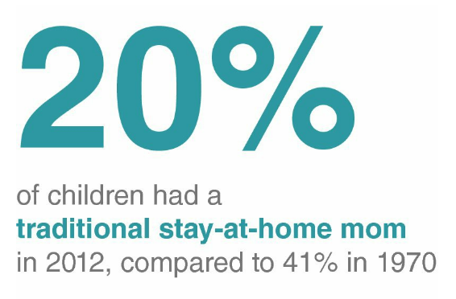
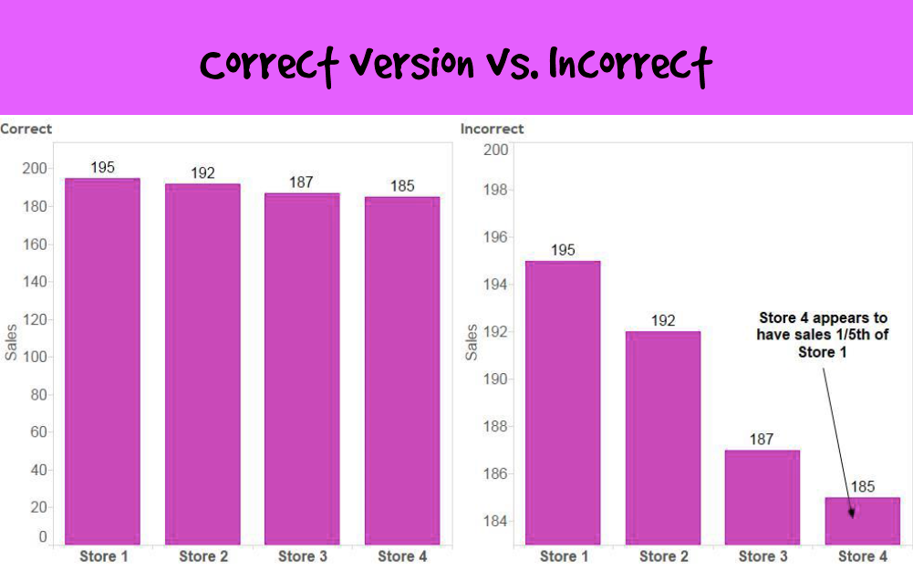
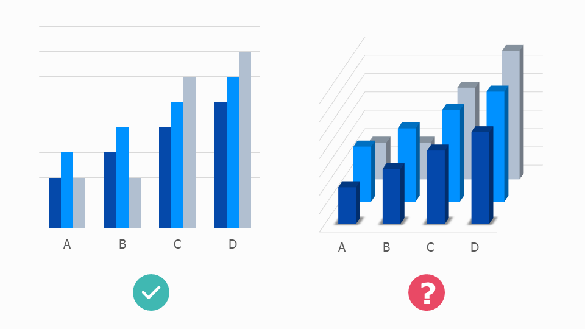

## {.iclicker}

:::{.question}
According to the chapter, why should you generally avoid tables in live presentations?
:::

:::{.choices}
A. They are visually unattractive

B. The audience will read them instead of listening

C. They are too difficult to create

D. They cannot show enough data
:::

:::{.notes}
B
:::

## {.iclicker}

:::{.question}
What is a key requirement when using time on the x-axis in a line graph?
:::

:::{.choices}
A. Values must start at zero

B. Data must be categorical

C. There must be at least two lines

D. Time intervals must be consistent
:::

:::{.notes}
D
:::

## {.iclicker}

:::{.question}
According to the chapter, what is the main reason pie charts are discouraged?
:::

:::{.choices}
A. People cannot accurately compare angles and areas

B. They take up too much space

C. They cannot display more than a few categories

D. They require too much data preparation
:::

:::{.notes}
A
:::


## Key Message

:::{.main-point}
Choose the visual that makes your message easiest to understand.
:::

## Big Idea in Practice

- Start with the audience
- Clarify the decision or purpose
- Choose the simplest visual that supports that purpose
- Remove anything that does not help comprehension

:::{.notes}
Time: 2 minutes.
Repeat: audience + purpose before chart type.
:::


## Choose the visual

Instructions

- Work in small groups
- For each scenario, sketch the best visual
- Be ready to share


## Scenarios (4)

1. GDP for three countries from 2000 to 2025 (5 year intervals)
2. Household income vs. household spending for 500 households
3. Company market share across five brands (20%, 35%, 15%, 25%, 5%)
4. Customer satisfaction for 3 products in 2026 (90%, 85%, 92%) and 2027 (88%, 87%, 91%)

Be ready to share your choices and reasoning.


## Decision Framework{.scrollable}

Use this quick guide when selecting a visual:

| Situation | Best default |
|---|---|
| One or two numbers | Simple text |
| Need precise lookup | Table |
| Relationship | Scatterplot |
| Time | Line graph |
| Categories | Bar chart |

:::{.notes}
Time: 4 minutes.
Walk top to bottom with one example each.
:::


## Principle 1: Simple Text Can Be Best

:::: {.columns}

::: {.column width="58%"}
- If you have only one or two key numbers, write them directly
- A chart can add cognitive load when the message is small
- Lead with the number and context
:::

::: {.column width="42%"}
<div style="background: white; color: #222; border-radius: 14px; padding: 18px; min-height: 210px; display: flex; align-items: center; justify-content: center; text-align: center;">
  
</div>
:::

::::


## Same Data, Two Formats {.scrollable}

```{r}
#| echo: false
#| warning: false
#| message: false

# Reproducible sample of 10 cars and horsepower
set.seed(330)
cars_df <- data.frame(
  car = rownames(mtcars),
  hp = mtcars$hp,
  row.names = NULL
)
idx <- sort(sample(seq_len(nrow(cars_df)), 10))
cars_small <- cars_df[idx, ]

# 1) Table: exact value lookup
knitr::kable(
  cars_small
)
```

## Same Data as a Visual

```{r}
#| echo: false
#| warning: false
#| message: false
#| fig-width: 8
#| fig-height: 4.5

# Recreate the same sampled rows for a reproducible plot
set.seed(330)
cars_df <- data.frame(
  car = rownames(mtcars),
  hp = mtcars$hp,
  row.names = NULL
)
idx <- sort(sample(seq_len(nrow(cars_df)), 10))
cars_small <- cars_df[idx, ]

ggplot2::ggplot(
  cars_small,
  ggplot2::aes(x = reorder(car, hp), y = hp)
) +
  ggplot2::geom_col(fill = "#4C78A8", alpha = 0.9) +
  ggplot2::coord_flip() +
  ggplot2::labs(
    title = "Same mtcars Sample as a Bar Chart",
    x = "Car",
    y = "Horsepower"
  ) +
  ggplot2::theme_minimal(base_size = 14)
```


## Principle 2: Tables vs. Graphs

:::: {.columns}

::: {.column width="50%"}
**Tables = read (slow)**

:::{.incremental}
- Exact values
- Lookup tasks
- Dense detail
:::
:::

::: {.column width="50%"}
**Graphs = see (fast)**

:::{.incremental}
- Patterns
- Comparisons
- Trends and outliers
:::
:::

::::


## Principle 3: Match Type to Question

| If the question is... | Then use... |
|---|---|
| Are these two variables associated? | Scatterplot |
| How did this change over time? | Line graph |
| Which category is larger/smaller? | Bar chart |


# Common Mistakes

## Mistake 1: Bar Charts That Do Not Start at Zero{.scrollable}

<div style="background: white; color: #222; border-radius: 14px; padding: 20px; min-height: 250px; display: flex; align-items: center; justify-content: center; text-align: center;">

</div>

- Truncated axes exaggerate differences
- For bars, baseline matters for fair comparison


## Mistake 2: Pie Charts{.scrollable}

<div style="background: white; color: #222; border-radius: 14px; padding: 20px; min-height: 250px; display: flex; align-items: center; justify-content: center; text-align: center;">
  
</div>
- Hard to compare angles and similar slices
- Labels and legends increase eye travel
- Prefer bars for most category comparisons


## Mistake 3: 3D Effects{.scrollable}

<div style="background: white; color: #222; border-radius: 14px; padding: 20px; min-height: 250px; display: flex; align-items: center; justify-content: center; text-align: center;">
  
</div>

- 3D distorts lengths and areas
- Perspective hides true values
- Decoration reduces clarity


## Mistake? 4: Secondary Axes[^1] {.scrollable}


<div style="background: white; color: #222; border-radius: 14px; padding: 20px; min-height: 250px; display: flex; align-items: center; justify-content: center; text-align: center;">
  
</div>

- Two scales can imply misleading relationships
- Use separate charts when in doubt

[^1]: [Datawrapper: Why not to use two axes, and what to use instead](https://www.datawrapper.de/blog/dualaxis)

## Dual Axis Alternatives{.scrollable}

Two separate charts


Index


# Activity 2: Fix This Visual

## Redesign Challenge{.scrollable}

- Identify the main problem in each visual
- Redesign it for faster audience understanding
- Explain your redesign choice in one sentence

:::: {.columns}

::: {.column width="33%"}
<div style="background: white; color: #222; border-radius: 14px; padding: 12px; min-height: 210px; display: flex; align-items: center; justify-content: center; text-align: center;">
  <strong>TODO: Pie chart placeholder</strong>
</div>
:::

::: {.column width="33%"}
<div style="background: white; color: #222; border-radius: 14px; padding: 12px; min-height: 210px; display: flex; align-items: center; justify-content: center; text-align: center;">
  <strong>TODO: Misleading bar chart placeholder</strong>
</div>
:::

::: {.column width="33%"}
<div style="background: white; color: #222; border-radius: 14px; padding: 12px; min-height: 210px; display: flex; align-items: center; justify-content: center; text-align: center;">
  <strong>TODO: Cluttered table placeholder</strong>
</div>
:::

::::

:::{.notes}
Time: 1 minute setup, 6 minutes group redesign, 3 minutes report out.
:::

# Wrap-Up

## Exit Prompt

What rule will you actually use in your next chart?

## Final Takeaway

:::{.main-point}
The best visual is the one your audience understands fastest.
:::
