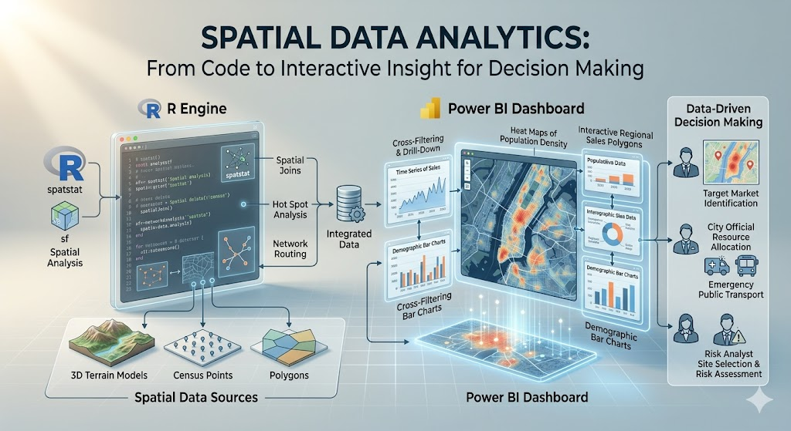

This lab introduces spatial data as a tool for data-driven decision making. You will work with the dataset on corn yield and drought conditions in two settings. First, you will use **Power BI** to build an interactive map and scatterplot (this portion of the lab is OPTIONAL). Then you will use **R** to build a similar interactive version (not optional). The goal is not to become a GIS specialist in one lab (see other courses at CSU or free ArcGIS Online modules if you're interested in learning more). The goal is to learn how location can add meaning to a dataset and how interactive visuals can support exploration and communication.

Throughout the lab, keep asking yourself these questions:

- What decision could this visual support?
- What does the map add that a table or ordinary chart does not?
- When is interactivity useful, and when is it unnecessary?


## Preliminaries

1. Create a folder called `lab_9` and navigate there in RStudio or VS Code.
2. Download and save the corn yield and drought dataset in that folder (can download here: [final_merged_data.csv](https://jbayham.github.io/arec-330/modules/05_EDA/includes/final_merged_data.csv)).
3. Create a new R script called `lab_9.R` in your `lab_9` folder.
4. Write a brief comment at the top describing the purpose of the script and your name.
5. Open a Word document, Google Doc, or plain text document to use as your **lab notebook**.

:::{.callout-note}
This lab assumes your dataset contains at least:

- a geographic field such as `state`, `county`, or latitude/longitude
- a corn yield variable
- a drought variable

If your file uses different names, you will rename them in Part 2.
:::

---

## Part 1: Build an Interactive Spatial Visual in Power BI

In this part, you will create a simple interactive report in Power BI using built-in visuals. You will place a **map** and a **scatterplot** next to each other and add a **state slicer**. You will also turn on cross-filtering so selecting a state in the map updates the scatterplot.

The point of this exercise is not just to make a dashboard. The point is to see how a map and a chart can work together to answer questions about geographic patterns and relationships in the data.

### Scenario

Imagine you are helping an agricultural analyst explore variation in corn yield and drought conditions across places in the United States. The analyst wants to answer questions like:

- Where are drought conditions most severe?
- How does drought relate to corn yield?
- Does that relationship look different across states?

A map is useful because it shows **where** conditions are occurring. A scatterplot is useful because it shows the **relationship** between two quantitative variables. A slicer or selection interaction is useful because it lets the analyst narrow the view to a specific state or set of states.

### Step 1: Import the dataset into Power BI

1. Open **Power BI**.
2. Select **New report** and then **Get data** and import your corn yield and drought dataset, filter for only one year.
3. In the data preview window, make sure the fields loaded correctly.
4. If needed, clean variable types in Power Query:
   - geographic variables should be text unless they are coordinates
   - yield and drought variables should be numeric
   - latitude and longitude should be decimal numbers if present
5. Click **Close & Apply**.

### Step 2: Inspect the geographic fields

Before building a map, identify which field Power BI can use for geography.

Possible options include:

- `state`
- `county`
- `state_abbrev`
- `latitude` and `longitude`

If you are mapping U.S. states, it often helps to set the data category for the state field:

1. Click the field in the data pane.
2. Go to **Column tools**.
3. Set **Data category** to **State or Province**.

If you have latitude and longitude, set those categories as **Latitude** and **Longitude**.

### Step 3: Create the map

Build a map using one of Power BI's built-in map visuals.

#### Filled map by state

Use this option if your dataset has one row per state or can be aggregated to the state level.

- Add a **Filled map** visual.
- Drag `state` to **Location**.
- Drag a drought or yield variable to **Color saturation** or the value/color field, depending on the visual.
- Add `state`, corn yield, and drought to **Tooltips**.

### Step 4: Create the scatterplot

Now place a scatterplot to the right of the map.

Suggested setup:

- **x-axis:** drought variable
- **y-axis:** corn yield variable
- **Details:** county, location, year, or another field that distinguishes observations
- **Legend (optional):** state or another categorical variable if you want to color points by category. If you have a lot of points, consider leaving the legend off to reduce clutter.
- **Tooltips:** state, county, drought, corn yield

The scatterplot should help you see whether places with more drought tend to have lower corn yield.

### Step 5: Add a slicer by state

Add a slicer so the report can be filtered by state.

- Add a **Slicer** visual.
- Drag the `state` field into the slicer.
- Change the slicer to a dropdown if you want it to take up less space.

### Step 6: Turn on interaction between visuals

Make sure the map, scatterplot, and slicer work together.

1. Click the map.
2. Go to **Format** > **Edit interactions**.
3. Make sure the scatterplot is set to **filter** or **highlight** when a location is selected on the map.
4. Test the interaction by clicking one state or one point on the map.
5. Confirm that the scatterplot updates.

You should now have:

- a map on one side
- a scatterplot on the other
- a slicer for state
- linked interaction across visuals

### Step 7: Improve readability

Do a small amount of formatting so the report is easier to read.

Suggested improvements:

- use a clear title for each visual
- reduce unnecessary legends if they are redundant
- keep the color scale simple
- make tooltips informative but short
- align the visuals neatly

### Power BI reflection questions (OPTIONAL)

:::{.callout-attention}
Answer Questions 1-3 in your lab notebook.

**Question 1.** What does the map help you see that would be hard to notice in the scatterplot alone?

**Question 2.** What does the scatterplot help you see that would be hard to notice in the map alone?

**Question 3.** Select a state using the map or slicer. What changes in the scatterplot, and what does that tell you about the relationship between drought and corn yield within that state?
:::

---

## Part 2: Build an Interactive Spatial Visual in R

Now recreate the same general idea in R. You will import the same dataset, merge with spatial data, and produce an interactive chart. You will use the **`tmap** package for an interactive map. 

This section reinforces an important idea from class: the analytical task matters more than the software. Different tools can communicate similar ideas.

### Step 0: Load/install packages

```{r}
#| eval: false
library(tidyverse)
library(sf) # for spatial data handling
library(tigris) # for US spatial data (state boundaries)
library(tmap) # for interactive mapping
```

### Step 1: Load the corn dataset

```{r}
#| eval: false
corn_dat <- read_csv("final_merged_data.csv")
```

Inspect the data:

```{r}
#| eval: false
names(corn_dat)
glimpse(corn_dat)
summary(corn_dat)
```

### Step 2: Merge with spatial data

```{r}
#| eval: false
# Load state boundaries
states <- tigris::states()

# Filter corn_dat to one year (for plotting)
corn_dat <- corn_dat %>% filter(year == 2012)

# Merge with corn dataset by state name
corn_sf <- corn_dat %>%
  left_join(states, by = c("abbr" = "state"))

# Make sure corn_sf is really an sf (simple features) object
corn_sf <- st_as_sf(corn_sf) # this function converts non-sf objects to sf if a geometry column is present
```

:::{.callout-attention}
Look at the new merged dataset. Answer all parts of Question 4 in your lab notebook.

**Question 4:** What columns are new? Which one contains the geometry? What kind of geometry is it (point, line, polygon)? What does that geometry represent in this context?

:::

### Step 3: Build an interactive map in `tmap`

Set `tmap` to interactive viewing mode:

```{r}
#| eval: false
tmap_mode("view")
```

Now create a simple interactive map colored by drought or yield.

```{r}
#| eval: false
tm_shape(corn_sf) +
  tm_polygons(
    col = "yield_bu_per_acre",
    palette = "YlGn",
    title = "Corn Yield"
  ) +
  tm_layout(
    title = "2012 Corn Yield by State",
    legend.outside = TRUE
  )
```

You could also color by `farm_gdp` instead (or `mean_dsci`).

```{r}
#| eval: false
tm_shape(corn_sf) +
  tm_polygons(
    col = "farm_gdp",
    palette = "YlGn",
    title = "Farm GDP"
  ) +
  tm_layout(
    title = "2012 Farm GDP by State",
    legend.outside = TRUE
  )
```

### Step 4: Compare the tools

Think about the two environments you used.

- Power BI made it easy to connect multiple visuals with point-and-click interaction.
- R makes it easier to document the workflow, customize code, and reproduce the analysis.

Neither is universally better. The right tool depends on the audience, purpose, and workflow.

### R reflection questions

:::{.callout-attention}
Answer Questions 5-6 in your lab notebook.

**Question 5.** What did you have to do to prepare the data before plotting it interactively?

**Question 6.** Compare your Power BI report and your R visual. Which would be better for a non-technical audience? Which would be better for a reproducible analysis workflow?
:::

---

## Part 3: Interpretation and Communication

Now step back from the software and focus on the analytical message.

Imagine you need to explain this dataset to someone making a decision about agricultural conditions, drought exposure, or yield risk.

:::{.callout-attention}
Answer Questions 7-8 in your lab notebook.

**Question 7.** What is one useful insight about the spatial pattern of drought or corn yield that becomes easier to see with a map?

**Question 8.** Suppose you had to brief a decision-maker in one sentence. What would you want them to take away from your map and scatterplot?
:::

---

## Deliverables

Submit on Canvas:

1. **Log file (`lab_9.log`)**
   Use the sink-source-sink pattern. Your log should include code, output, and brief comments.

2. **Lab notebook** with answers to Questions 4-8

3. **Screenshots or exports** of:
   - at least one interactive R visual

---

