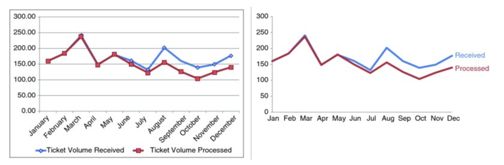

```{r}
#| include: false

library(ggplot2)

accent <- "#C8C372"
blue <- "#4C78A8"
alert <- "#C0504D"
muted <- "gray75"

refine_theme <- theme_minimal(base_size = 15) +
  theme(
    plot.background = element_rect(fill = "white", color = NA),
    panel.background = element_rect(fill = "white", color = NA),
    panel.grid.minor = element_blank(),
    legend.title = element_blank(),
    legend.background = element_rect(fill = "white", color = NA),
    plot.title.position = "plot",
    axis.title.x = element_text(margin = margin(t = 10)),
    axis.title.y = element_text(margin = margin(r = 10))
  )
```

## From Making to Refining Charts

- Previously, the question was: **what visual should I use?**
- Now, the question is: **what needs to change so the message is obvious?**
- A chart is not finished when it is accurate
- It is finished when a decision-maker can intepret and comprehend it

:::{.notes}
Time: 2 minutes.

Frame the shift clearly:

- Choosing the chart type is necessary, but not sufficient.
- Refinement is how we reduce friction for the audience.
- This is not decoration. It is part of making analysis usable.
:::


## Clutter Is More Than Ugly

- Every visual element uses audience attention
- **Signal** helps answer the question
- **Noise** slows the audience down without improving understanding
- If a border, label, marker, or color does not earn its space, question it

> A visual can be technically correct and still be harder to read than it needs to be.

:::{.notes}
Time: 2 minutes.

Use the reading language:

- every added element imposes cognitive load
- clutter is anything that does not improve understanding enough to justify its presence
:::

## Common Sources of Clutter {.scrollable}

:::: {.columns}

::: {.column width="50%"}
:::{.incremental}
- borders and background shading
- heavy gridlines
- excessive labels
- unnecessary legends
:::
:::

::: {.column width="50%"}
:::{.incremental}
- too many colors
- data markers that add no value
- diagonal text when horizontal text would work
- repeated detail that competes with the main point
:::
:::

::::

<!-- **Discussion prompt**

- What could be removed without losing meaning? -->

:::{.notes}
Time: 2 minutes.

Emphasize that clutter is not just "too much stuff."
It is specifically stuff that costs attention but does not improve comprehension.
:::

## Applied Example 1

- Audience: board of directors
- Decision: which region to conduct a pricing review
- Goal: communicate that the West division has the lowest operating margin

## Applied Example 1: Before

What is your eye drawn to first?

What is making this slower to read?

```{r}
#| echo: false
#| warning: false
#| message: false
#| fig-width: 8
#| fig-height: 4.8

divisions <- c("North", "South", "East", "Central", "West")
margin <- c(18.4, 16.9, 15.7, 13.6, 11.8)

df <- data.frame(
  division = factor(divisions, levels = divisions),
  margin = margin
)

ggplot(df, aes(x = division, y = margin, fill = division)) +
  geom_col(width = 0.7, color = "gray25", linewidth = 0.7) +
  geom_text(aes(label = paste0(margin, "%")), vjust = -0.4, size = 4) +
  scale_fill_manual(
    values = c(
      "North" = "#4F81BD",
      "South" = "#C0504D",
      "East" = "#9BBB59",
      "Central" = "#8064A2",
      "West" = "#4BACC6"
    )
  ) +
  scale_y_continuous(
    limits = c(0, 20),
    breaks = seq(0, 20, 2),
    expand = expansion(mult = c(0, 0.08))
  ) +
  labs(
    title = "Operating Margin by Division",
    x = "Business division",
    y = "Operating margin (%)"
  ) +
  refine_theme +
  theme(
    panel.grid.major = element_line(color = "gray55", linewidth = 0.7),
    panel.grid.minor = element_line(color = "gray75", linewidth = 0.4),
    axis.text.x = element_text(angle = 45, hjust = 1),
    legend.position = "bottom",
    panel.border = element_rect(color = "gray35", fill = NA, linewidth = 0.8)
  )
```

:::{.notes}
Time: 2 minutes.

Expected student comments:

- too many colors for one comparison
- legend is redundant
- heavy gridlines and border compete with the bars
- angled labels slow reading
:::

## Applied Example 1: After

Decision implication:

Focus the next pricing review on **West**, the lowest-margin division.

```{r}
#| echo: false
#| warning: false
#| message: false
#| fig-width: 8
#| fig-height: 4.8

divisions <- c("North", "South", "East", "Central", "West")
margin <- c(18.4, 16.9, 15.7, 13.6, 11.8)

df <- data.frame(
  division = factor(divisions, levels = rev(divisions)),
  margin = margin,
  status = ifelse(divisions == "West", "Highlight", "Other")
)

ggplot(df, aes(x = division, y = margin, fill = status)) +
  geom_col(width = 0.72, color = NA, show.legend = FALSE) +
  geom_text(aes(label = paste0(margin, "%")), hjust = -0.15, size = 4) +
  scale_fill_manual(values = c("Highlight" = accent, "Other" = muted)) +
  scale_y_continuous(
    limits = c(0, 20.5),
    breaks = seq(0, 20, 5),
    expand = expansion(mult = c(0, 0))
  ) +
  coord_flip() +
  labs(
    title = "West has the thinnest operating margin",
    x = NULL,
    y = "Operating margin (%)"
  ) +
  refine_theme +
  theme(
    panel.grid.major.y = element_blank(),
    plot.margin = margin(10, 28, 10, 10)
  )
```

<!-- - One accent color
- No legend
- Horizontal labels
- Title states the takeaway -->

:::{.notes}
Time: 2 minutes.

Key redesign moves:

- reduce gridlines
- mute the nonessential bars
- direct labels reduce eye travel
- rewrite the title so the audience gets the message immediately
:::

## Reduce Clutter

1. Remove chart border
2. Remove gridlines
3. Remove data markers
4. Clean up axis labels
5. Label data directly
6. Leverage consistent color

##



## Focus Attention on Purpose

<!-- :::: {.columns}

::: {.column width="46%"} -->
**Fast signals**: color, size, position
<!-- :::

::: {.column width="54%"} -->

**Use them to**

<!-- :::{.incremental} -->
- show the audience where to look first
- push nonessential elements into the background
- create a visual hierarchy
<!-- :::
:::

:::: -->

If everything is bold, colorful, and large, nothing stands out.

:::{.notes}
Time: 3 minutes.

This is the preattentive attributes slide.

Key ideas:

- people do not read everything equally
- color, size, and position can direct attention quickly
- use them sparingly, because highlighting one thing makes other things recede
:::

## Applied Example 2

Audience: IT director
Decision: Increase capacity 
Goal: communicate that the backlog of support tickets is growing

## Applied Example 2: Before

What is the main message of this chart?

Is it visible quickly?

```{r}
#| echo: false
#| warning: false
#| message: false
#| fig-width: 8
#| fig-height: 4.8

ticket_df <- data.frame(
  month_num = rep(1:8, 2),
  month = rep(c("Jan", "Feb", "Mar", "Apr", "May", "Jun", "Jul", "Aug"), 2),
  series = rep(c("Tickets received", "Tickets resolved"), each = 8),
  tickets = c(118, 121, 125, 129, 134, 139, 145, 149,
              120, 122, 123, 124, 123, 121, 119, 118)
)

ggplot(ticket_df, aes(x = month_num, y = tickets, color = series, group = series)) +
  geom_line(linewidth = 1.6) +
  geom_point(size = 3) +
  geom_text(aes(label = tickets), vjust = -0.8, size = 3.2, show.legend = FALSE) +
  scale_color_manual(
    values = c("Tickets received" = blue, "Tickets resolved" = alert)
  ) +
  scale_x_continuous(breaks = 1:8, labels = c("Jan", "Feb", "Mar", "Apr", "May", "Jun", "Jul", "Aug")) +
  scale_y_continuous(
    limits = c(110, 155),
    breaks = seq(110, 155, 5),
    expand = expansion(mult = c(0, 0.05))
  ) +
  labs(
    title = "Support Tickets Received and Resolved",
    x = "Month",
    y = "Tickets"
  ) +
  refine_theme +
  theme(
    panel.grid.major = element_line(color = "gray65", linewidth = 0.7),
    legend.position = "top",
    panel.border = element_rect(color = "gray35", fill = NA, linewidth = 0.8)
  )
```

:::{.notes}
Time: 2 minutes.

Students will usually identify the gap eventually, but they have to work for it.
That is the problem.
:::

## Applied Example 2: After

Decision implication:

Backlog is widening, so capacity needs to increase or demand must be managed.

```{r}
#| echo: false
#| warning: false
#| message: false
#| fig-width: 8
#| fig-height: 4.8

received <- data.frame(
  month_num = 1:8,
  tickets = c(118, 121, 125, 129, 134, 139, 145, 149)
)

resolved <- data.frame(
  month_num = 1:8,
  tickets = c(120, 122, 123, 124, 123, 121, 119, 118)
)

ggplot() +
  annotate("rect", xmin = 4.6, xmax = 8.55, ymin = 110, ymax = 155, fill = "gray96", color = NA) +
  geom_line(data = received, aes(x = month_num, y = tickets), color = "gray65", linewidth = 1.5) +
  geom_line(data = resolved, aes(x = month_num, y = tickets), color = accent, linewidth = 1.9) +
  geom_point(data = received[8, ], aes(x = month_num, y = tickets), color = "gray55", size = 3) +
  geom_point(data = resolved[8, ], aes(x = month_num, y = tickets), color = accent, size = 3.4) +
  annotate("segment", x = 8, xend = 8, y = 118, yend = 149, color = alert, linewidth = .5, linetype = "dashed") +
  annotate("text", x = 8.35, y = 149, label = "Received", hjust = 0, color = "gray50", size = 4) +
  annotate("text", x = 8.35, y = 118, label = "Resolved", hjust = 0, color = accent, size = 4) +
  # annotate("text", x = 7.0, y = 152, label = "Gap opens here", color = alert, size = 4.2) +
  annotate("text", x = 8.28, y = 133.5, label = "31-ticket\ngap", hjust = 0, color = alert, size = 4.1) +
  scale_x_continuous(
    breaks = 1:8,
    labels = c("Jan", "Feb", "Mar", "Apr", "May", "Jun", "Jul", "Aug"),
    expand = expansion(mult = c(0.02, 0.2))
  ) +
  scale_y_continuous(
    limits = c(110, 155),
    breaks = seq(110, 155, 10),
    expand = expansion(mult = c(0, 0))
  ) +
  labs(
    title = "From May onward, incoming tickets exceed resolved tickets",
    x = "Month",
    y = "Tickets"
  ) +
  refine_theme +
  theme(
    panel.grid.major.x = element_blank(),
    panel.grid.major.y = element_line(color = "gray92"),
    plot.margin = margin(10, 60, 10, 10)
  )
```

<!-- - nonessential detail pushed back
- direct labels replace the legend
- color is used only where emphasis helps
- the title translates the evidence into a takeaway -->

:::{.notes}
Time: 2 minutes.

This slide demonstrates:

- mute the background
- highlight only the important difference
- put labels near the data
- use title + annotation to guide attention
:::


# Activity: Visual Redesign

## Small-Group Activity {.scrollable}

**Work in pairs or groups of three**

1. Diagnose one cluttered visual
2. Decide what to remove
3. Decide what to mute or push to the background
4. Decide what to highlight
5. Write the first takeaway a decision-maker should see

Be ready to give a 30-second redesign pitch.

:::{.notes}
Time: 2 minutes setup, 8 minutes group work.

If helpful, assign half the room to Visual A and half to Visual B.
You can also replace one of these with your own chart.
:::

## Activity Visual A

What would you remove, mute, highlight, and rewrite?

```{r}
#| echo: false
#| warning: false
#| message: false
#| fig-width: 8
#| fig-height: 4.8

activity_a <- data.frame(
  warehouse = rep(c("Fort Collins", "Denver Metro", "Pueblo", "Grand Junction"), each = 4),
  quarter = rep(c("Q1", "Q2", "Q3", "Q4"), times = 4),
  rate = c(96, 95, 94, 95, 93, 91, 92, 90, 88, 94, 93, 92, 91, 90, 89, 88)
)

ggplot(activity_a, aes(x = warehouse, y = rate, fill = quarter)) +
  geom_col(position = position_dodge(width = 0.82), width = 0.7, color = "gray35") +
  geom_text(
    aes(label = paste0(rate, "%")),
    position = position_dodge(width = 0.82),
    vjust = -0.35,
    size = 3.4
  ) +
  scale_fill_manual(values = c("Q1" = "#4F81BD", "Q2" = "#9BBB59", "Q3" = "#C0504D", "Q4" = "#8064A2")) +
  scale_y_continuous(
    breaks = seq(80, 100, 2),
    expand = expansion(mult = c(0, 0.06))
  ) +
  coord_cartesian(ylim = c(80, 100)) +
  labs(
    title = "On-Time Delivery Rate by Warehouse and Quarter",
    x = "Warehouse",
    y = "On-time delivery (%)"
  ) +
  refine_theme +
  theme(
    panel.grid.major = element_line(color = "gray65", linewidth = 0.7),
    axis.text.x = element_text(angle = 45, hjust = 1),
    legend.position = "right",
    panel.border = element_rect(color = "gray35", fill = NA, linewidth = 0.8)
  )
```


:::{.notes}
Possible redesign direction:

- warehouse ordering
- direct labels or fewer labels
- maybe focus on Q3 or change from Q1 to Q3 instead of all grouped bars
:::

## Activity Visual B

What would you remove, mute, highlight, and rewrite?

```{r}
#| echo: false
#| warning: false
#| message: false
#| fig-width: 8
#| fig-height: 4.8

activity_b <- data.frame(
  year = rep(2019:2024, 4),
  channel = rep(c("Search", "Email", "Social", "Referral"), each = 6),
  cost = c(42, 44, 45, 46, 47, 49,
           38, 37, 36, 35, 35, 34,
           31, 34, 38, 43, 48, 52,
           45, 44, 43, 43, 42, 42)
)

ggplot(activity_b, aes(x = year, y = cost, color = channel, group = channel)) +
  geom_line(linewidth = 1.5) +
  geom_point(size = 2.8) +
  scale_color_manual(
    values = c(
      "Search" = "#4F81BD",
      "Email" = "#9BBB59",
      "Social" = "#C0504D",
      "Referral" = "#8064A2"
    )
  ) +
  scale_x_continuous(breaks = 2019:2024) +
  scale_y_continuous(
    limits = c(28, 55),
    breaks = seq(30, 55, 5),
    expand = expansion(mult = c(0, 0.03))
  ) +
  labs(
    title = "Customer Acquisition Cost by Channel",
    x = "Year",
    y = "Cost per acquired customer ($)"
  ) +
  refine_theme +
  theme(
    panel.grid.major = element_line(color = "gray65", linewidth = 0.7),
    legend.position = "bottom",
    panel.border = element_rect(color = "gray35", fill = NA, linewidth = 0.8)
  )
```

- What should a decision-maker notice first?
- Would you keep one chart or split the story?

:::{.notes}
Possible redesign direction:

- direct label the lines
- mute the stable channels
- highlight the rapid rise in social cost
- consider whether the story is about level, trend, or change
:::

## Debrief

- What did your group remove first?
- What did you decide to mute?
- What did you choose to highlight?
- What takeaway should the audience see before anything else?

**Reminder:** refining a visual is not cosmetic. It changes how quickly and accurately someone understands the analysis.

:::{.notes}
Time: 5 minutes.

Look for whether groups can connect redesign moves to a management takeaway,
not just to aesthetics.
:::

## Final Takeaways

- Remove clutter
- Create order
- Guide attention
- Refine visuals with the audience and decision in mind

Refining a chart is part of analysis, not decoration.

:::{.notes}
Time: 1 minute.

Use this as the closing language for the day.
:::

# Project

## Lab this week

Lab will focus on how to redesign visuals

Have a draft of your project visual for class. We will workshop them in small groups and give feedback to each other. 

## Project checkin

- Think carefully about your audience and decision. 
- Does your analysis answer a question that matters to a real decision-maker?
- What is the one key message you want to communicate with your visual?